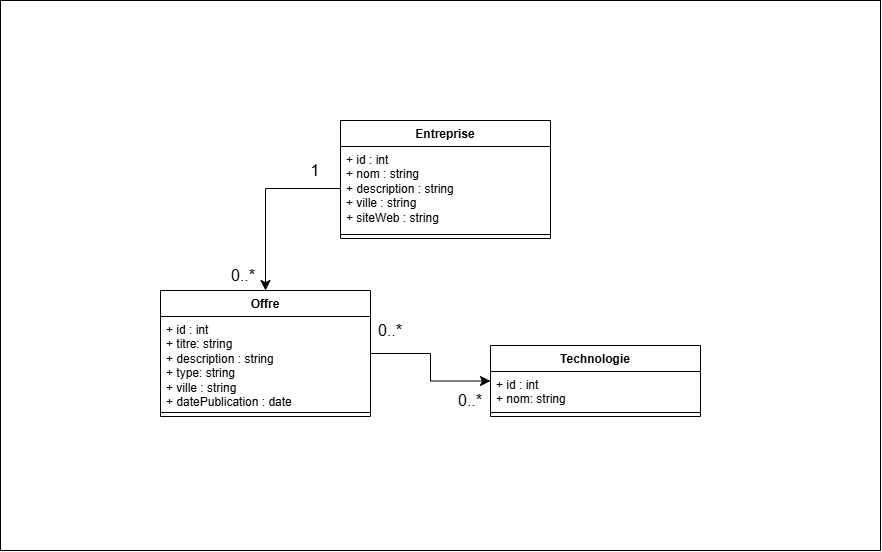

# Diagramme de classes UML

## Présentation

Le diagramme de classes représente les principales classes du domaine du Job Board ainsi que leurs attributs et leurs associations.

## Classes

Le système contient trois classes principales :

* **Entreprise** : représente l'entreprise qui publie les offres.
* **Offre** : représente une offre de stage ou d'alternance.
* **Technologie** : représente une technologie associée à une ou plusieurs offres.

## Associations

* Une **Entreprise** peut publier plusieurs **Offres** : `1` vers `0..*`.
* Une **Offre** appartient à une seule **Entreprise**.
* Une **Offre** peut utiliser plusieurs **Technologies** et une **Technologie** peut être associée à plusieurs **Offres** : `0..*` vers `0..*`.

## Diagramme

