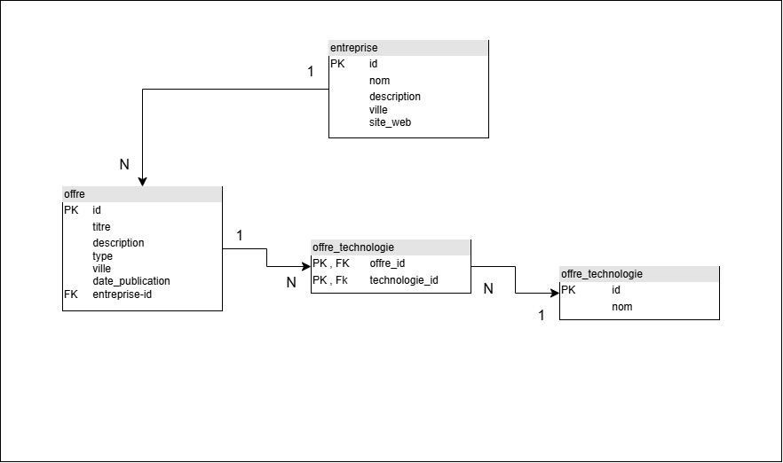

# Modèle relationnel logique

## Présentation

Le modèle relationnel logique présente la structure de la base de données du Job Board. Il définit les tables, les clés primaires, les clés étrangères et les relations entre les différentes tables.

## Tables

Le modèle contient quatre tables :

* `entreprise`
* `offre`
* `technologie`
* `offre_technologie`

La table `offre_technologie` permet de gérer la relation plusieurs-à-plusieurs entre les offres et les technologies.

## Diagramme

