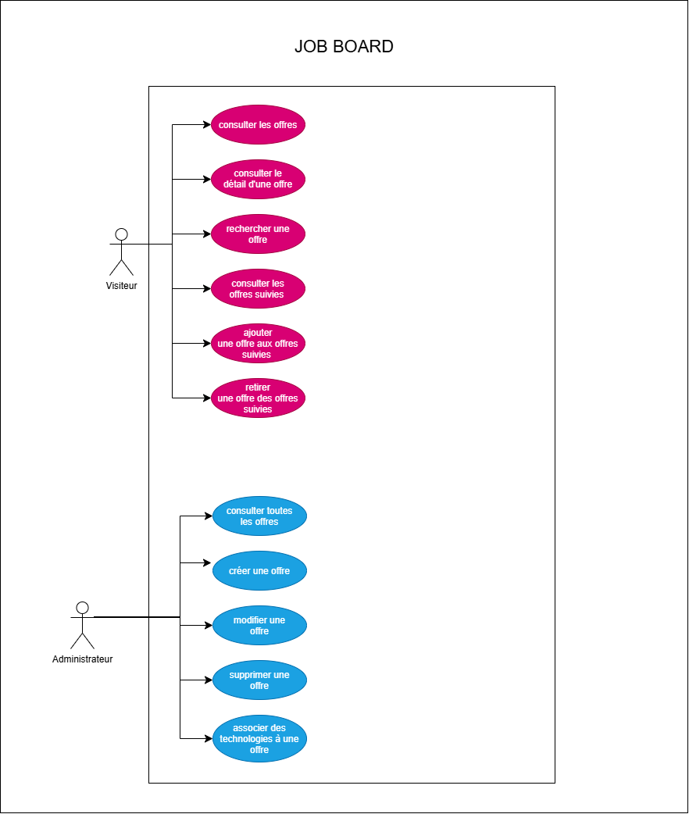

# Diagramme de cas d'utilisation

## Présentation

Le diagramme de cas d'utilisation présente les principales fonctionnalités du Job Board
ainsi que les acteurs qui interagissent avec l'application.

## Acteurs

### Visiteur

Le visiteur peut :
- consulter les offres ;
- consulter le détail d'une offre ;
- rechercher une offre ;
- filtrer les offres ;
- ajouter une offre aux offres suivies ;
- retirer une offre des offres suivies ;
- consulter les offres suivies.

### Administrateur

L'administrateur peut :
- consulter toutes les offres ;
- créer une offre ;
- modifier une offre ;
- supprimer une offre ;
- associer une ou plusieurs technologies à une offre.

## Diagramme

